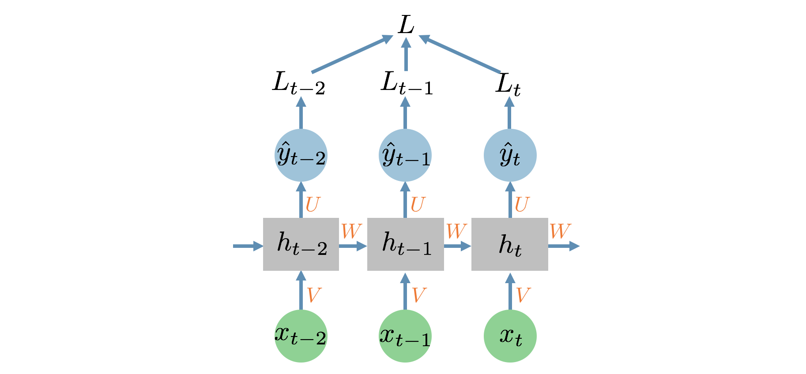
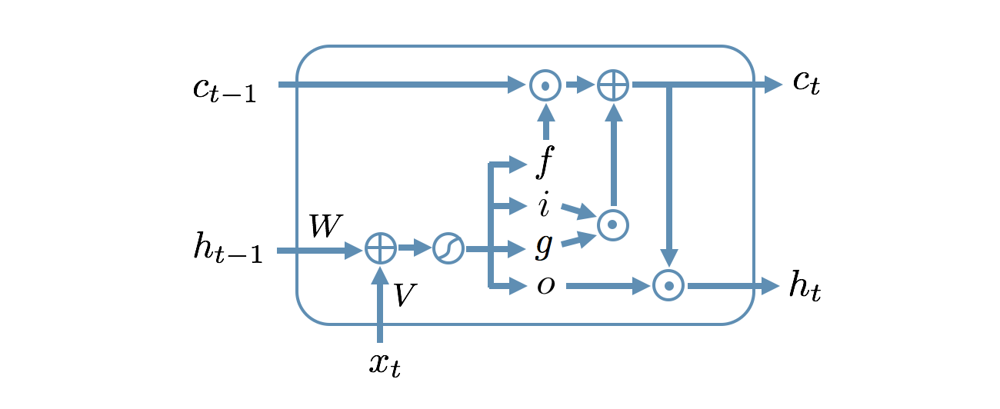
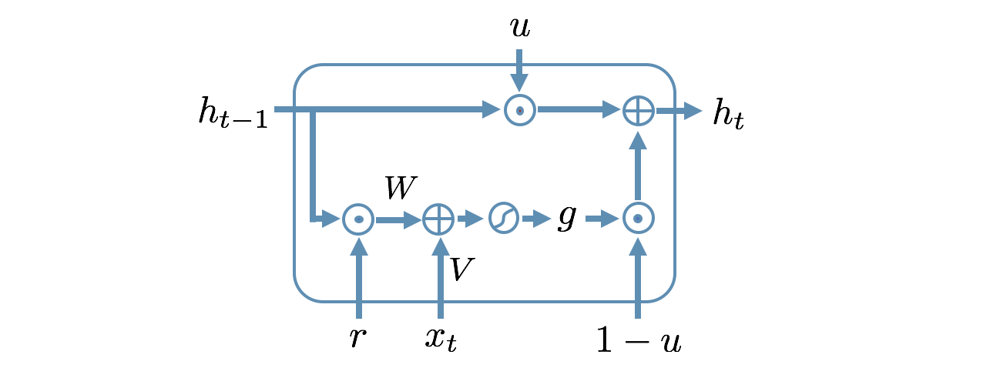
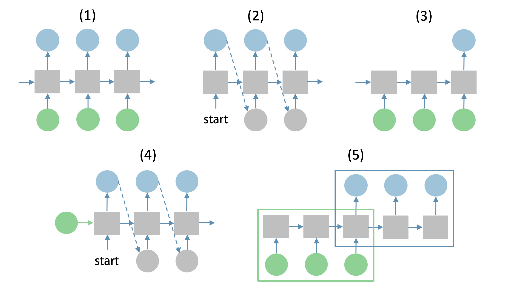
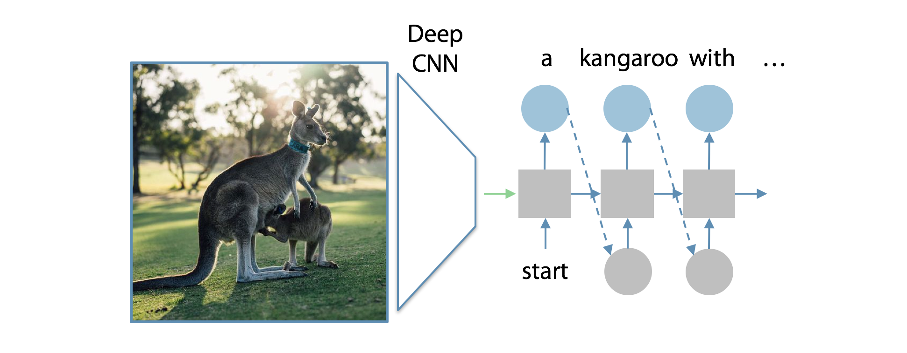

```python
import tensorflow as tf
import numpy as np
```

### Linear models

Consider a vector $(1, -2, 0.5)$. Apply a softmax transform to it and enter the first component (accurate to 2 decimal places).


```python
tf.nn.softmax([1, -2, 0.5])[0]
```


    <tf.Tensor: shape=(), dtype=float32, numpy=0.6037489>


Suppose you are solving a 5-class classification problem with 10 features. How many parameters a linear model would have? Don't forget bias terms!


```python
(10 + 1) * 5
```


    55


There is an analytical solution for linear regression parameters and MSE loss, but we usually prefer gradient descent optimization over it. What are the reasons?
+ [ ] Gradient descent is a method developed especially for MSE loss
+ [ ] Gradient descent can find parameter values that give lower MSE value than parameters from analytical solution
+ [x] Gradient descent doesn't require to invert a matrix
+ [x] Gradient descent is more scalable and can be applied for problems with high number of features

### Overfitting and regularization

Select correct statements about overfitting:
* [ ] Overfitting is a situation where a model gives comparable quality on new data and on a training sample
* [x] Large model weights can indicate that model is overfitted
* [ ] Overfitting happens when model is too simple for the problem
* [x] Overfitting is a situation where a model gives lower quality for new data compared to quality on a training sample

What disadvantages do model validation on holdout sample have?
* [x] It is sensitive to the particular split of the sample into training and test parts
* [ ] It requires multiple model fitting
* [x] It can give biased quality estimates for small samples

Suppose you are using k-fold cross-validation to assess model quality. How many times should you train the model during this procedure?
* [ ] $1$
* [x] $k$
* [ ] $k(k-1)/2$
* [ ] $k^2$

Select correct statements about regularization:
* [ ] Reducing the training sample size makes data simpler and then leads to better quality
* [x] Regularization restricts model complexity (namely the scale of the coefficients) to reduce overfitting
* [ ] Weight penalty reduces the number of model parameters and leads to faster model training
* [x] Weight penalty drives model parameters closer to zero and prevents the model from being too sensitive to small changes in features

### Multilayer perceptron

Choose the correct statements about MLP
* [ ] The first hidden layer contains predictions for your task
* [x] A hidden layer of MLP automatically learns new helpful features for the task
* [x] We can train MLP with SGD
* [ ] MLP can have only 1 hidden layer
* [ ] MLP with a linear activation function is better than a linear model

Apply a chain rule to calculate $\frac{\partial a}{\partial x}$ where $a(x, y) = sin(xy)\cdot e^x$.  
Here is an example of the syntax: `sin(x * y) * exp(x)`, more info [here](https://learner.coursera.help/hc/en-us/articles/208279916-Math-assignments).

**$$\left(y\cos{\left(xy\right)} + \sin{\left(xy\right)}\right) e^{x}$$**

Choose the correct statements about backpropagation
* [x] It is an efficient way to apply a chain rule
* [ ] You can use non-differentiable loss to train your MLP
* [x] It is the way to train modern neural networks
* [ ] It is done in one pass

What is the time complexity of backpropagation algorithm w.r.t. number of edges $N$ in the computational graph?
* [x] $O(N)$
* [ ] $O(log(N))$
* [ ] $O(N!)$
* [ ] $O(N^2)$

### Matrix derivatives

Choose the correct statements about MLP implementation:
* [x] You can write both passes of a dense layer with NumPy and make it quick even in Python
* [ ] You shouldn't prefer matrix operations when working with GPU
* [x] A forward pass of a dense layer can be done with matrix product
* [ ] A backward pass of a dense layer needs a 4-d tensor derivative

How many dimensions will a derivative of a 3-d tensor by a 4-d tensor have?  
$3 + 4 = 7$

Let's play around with matrix derivatives.  
A trace $Tr(X)$ of a matrix $X$ is a sum of its diagonal elements.  
For example: $Tr\begin{pmatrix}1&3\\3&1\end{pmatrix} = 1+1 = 2$. Note that trace is a scalar.  
Let's find a matrix notation for $\frac{\partial Tr(X^2)}{\partial X}$ for matrix $X = \begin{pmatrix}x_{1,1}&x_{1,2}\\x_{2,1}&x_{2,2}\end{pmatrix}$, where $X^2$ is a matrix product  $X\cdot X$.

Please do this element-wise and figure out a matrix notation for it:
* [ ] $Tr(2X)$
* [ ] $2Tr(X^T)$
* [ ] $X^TX$
* [x] $2X^T$
* [ ] $2X$

### Convolutions and pooling

Choose correct statements about convolutional layer:
* [x] Convolutional layer is a special case of a fully-connected layer  
    *Convolutional layer can be viewed as a special case of a fully connected layer when all the weights outside*  
    *the local receptive field of each output neuron equal 0*  
    *and kernel parameters are shared between neurons*
* [x] Convolutional layer works the same way for every input patch  
    *Because kernel parameters are shared!*
* [ ] Convolutional layer provides translation invariance
* [ ] Convolutional layer doesn't need a bias term

Choose correct statements about pooling layer:
* [x] Pooling layer provides translation invariance  
    *Remember the slash classifier example? Taking maximum gave us translation invariance.*
* [ ] Pooling layer is strictly differentiable
* [x] Pooling layer can reduce spatial dimensions (width and height of the input volume)  
    *When used with stride > 1*
* [ ] Pooling layer reduces the number of convolutional filters  

Back-propagation for convolutional layer first calculates the gradients as if the kernel parameters were not shared and then...
* [x] Takes a sum of gradients for each shared parameter
* [ ] Takes a minimum gradient for each shared parameter
* [ ] Takes a maximum gradient for each shared parameter
* [ ] Takes a mean of the gradients for each shared parameter

Suppose you have a 10x10x3 colour image input and you want to stack two convolutional layers with kernel size 3x3 with 10 and 20 filters respectively. How many parameters do you have to train for these two layers? Don't forget bias terms!


```python
(3 * 3 * 3 + 1) * 10 + (3 * 3 * 10 + 1) * 20
```


    2100


What receptive field do we have after stacking $n$ convolutional layers with kernel size $k \times k$ and stride 1? Layers numeration starts with 1. The resulting receptive field will be a square, input its side as an answer.

$k \times n - n + 1$

### Word embeddings

Which of the following is true about word2vec model?
* [ ] It's outputs (predictions) are linear functions of inputs.
* [ ] It uses convolutional layers and pooling.
* [ ] It has one trainable parameter per word.
* [ ] It requires human-defined semantic relations between words.
* [x] It requires some text corpora for training.

How can you train word2vec model?
* [x] By applying stochastic gradient descent.
* [ ] By minimizing distance between human-defined synonyms and maximizing distance between antonyms.
* [ ] By changing order of words in the corpora.
* [x] By minimizing crossentropy (aka maximizing likelihood).
* [x] By learning to predict context (neighboring words) given one word.
* [x] By learning to predict omitted word by it's context.

Here's an [online demo](http://bionlp-www.utu.fi/wv_demo/) of word2vec model. Let's use it to find synonyms for rare words.  
Don't forget to choose English GoogleNews model.  
Which of the following words is in top 10 synonyms for **"weltschmerz"**.
* [ ] big_bang
* [ ] decrystalization
* [ ] worldbuilding
* [x] despair

Which of the following is an appropriate way to measure similarity between word vectors v1 and v2? (more = better)
* [x] `-||v1 - v2||`
* [x] `cos(v1, v2)`
* [ ] `sin(v1, v2)`
* [ ] `||v1 - v2||`

### RNN and Backpropagation

Consider a task with input sequences of fixed length. Could RNN architecture still be useful for such task?
* [x] Yes
* [ ] No

Consider an RNN for a language generation task. $\hat{y}_t$ is an output of this RNN at each time step, $L$ is a length of the input sequence, $N$ is a number of words in the vocabulary. Choose correct statements about $\hat{y}_t$:
* [x] $\hat{y}_t$ is a vector of length $N$. 
* [ ] $\hat{y}_t$ is a vector of length $(L-t)$.
* [ ] $\hat{y}_t$ is a vector of length $L\times N$.
* [ ] Each element of $\hat{y}_t$ is either 0 or 1.
* [x] Each element of $\hat{y}_t$ is a number from 0 to 1.
* [ ] Each element of $\hat{y}_t$ is a number from 0 to $N$.

Consider the RNN from the lecture:  
$h_t = f_t(Vx_t+Wh_{t-1}+b_h)$  
$\hat{y}_t = f_y(Uh_t+b_y)$  


Calculate the gradient of the loss $L$ with respect to the bias vector $b_y$. $\frac{\partial L}{\partial b_y} = \bf{?}$
* [ ] $\frac{\partial L}{\partial b_y} = \frac{\partial L}{\partial \hat{y}_t}\frac{\partial \hat{y}_t}{\partial b_y}$
* [x] $\frac{\partial L}{\partial b_y} = \sum_{t=0}^T{\left[\frac{\partial L_t}{\partial \hat{y}_t}\frac{\partial \hat{y}_t}{\partial b_y}\right]}$
* [ ] $\frac{\partial L}{\partial b_y} = \sum_{t=0}^T{\left[\frac{\partial L_t}{\partial \hat{y}_t}\frac{\partial \hat{y}_t}{\partial h_t}\frac{\partial h_t}{\partial b_y}\right]}$
* [ ] $\frac{\partial L}{\partial b_y} = \sum_{t=0}^T{\left[\frac{\partial L_t}{\partial \hat{y}_t}\frac{\partial \hat{y}_t}{\partial h_t}\sum_{k=0}^t{\frac{\partial h_k}{\partial b_y}}\right]}$
* [ ] $\frac{\partial L}{\partial b_y} = \sum_{t=0}^T{\left[\frac{\partial L_t}{\partial \hat{y}_t}\frac{\partial \hat{y}_t}{\partial h_t}\sum_{k=0}^t{\left(\prod_{i=k+1}^t{\frac{\partial h_i}{\partial h_{i-1}}}\right)\frac{\partial h_k}{\partial b_y}}\right]}$

Consider the RNN network from the previous question. Calculate the gradient of the loss $L$ with respect to the bias vector $b_h$. $\frac{\partial L}{\partial b_h} = \bf{?}$
* [ ] $\frac{\partial L}{\partial b_h} = \frac{\partial L_t}{\partial \hat{y}_t}\frac{\partial \hat{y}_t}{\partial h_t}\frac{\partial h_t}{\partial b_h}$
* [ ] $\frac{\partial L}{\partial b_h} = \sum_{t=0}^T{\left[\frac{\partial L_t}{\partial \hat{y}_t}\frac{\partial \hat{y}_t}{\partial h_t}\frac{\partial h_t}{\partial b_h} \right]}$
* [ ] $\frac{\partial L}{\partial b_h} = \sum_{t=0}^T{\left[\frac{\partial L_t}{\partial \hat{y}_t}\frac{\partial \hat{y}_t}{\partial h_t}\sum_{k=0}^t{\frac{\partial h_k}{\partial b_h}}\right]}$
* [x] $\frac{\partial L}{\partial b_h} = \sum_{t=0}^T{\left[\frac{\partial L_t}{\partial \hat{y}_t}\frac{\partial \hat{y}_t}{\partial h_t}\sum_{k=0}^t{\left(\prod_{i=k+1}^t{\frac{\partial h_i}{\partial h_{i-1}}}\right)\frac{\partial h_k}{\partial b_h}}\right]}$

### Modern RNNs

Choose correct statements about the exploding gradient problem:
* [x] Exploding gradient problem is easy to detect.  
    *Exploding gradients are easy to detect, not vanishing.*
* [ ] ReLU nonlinearity helps with the exploding gradient problem.  
    *On the contrary, it may aggravate the problem.*
* [x] The reason of the exploding gradient problem in the simple RNN is the recurrent weight matrix $W$. Nonlinearities sigmoid, tanh, and ReLU does not cause the problem.  
    *Derivatives of all these nonlinearities are less than 1, therefore they may cause only the vanishing gradient problem.*
* [ ] The threshold for gradient clipping should be as low as possible to make the training more efficient.  
    *With low threshold training is very slow therefore we should use the highest threshold which helps with the exploding gradients.*

Choose correct statements about the vanishing gradient problem:
* [ ] Vanishing gradient problem is easy to detect.  
    *It is not clear how to detect vanishing gradient problem. See the lecture "Dealing with vanishing and exploding gradients" for the explanation.*
* [x] Both nonlinearity and the recurrent weight matrix $W$ cause the vanishing gradient problem.
* [x] Orthogonal initialization of the recurrent weight matrix helps with the vanishing gradient problem.
* [ ] Truncated BPTT helps with the vanishing gradient problem.  
    *On the contrary, it makes the gradient from faraway steps equal to zero.*

Consider the LSTM architecture:
$$\begin{pmatrix}g_t\\i_t\\o_t\\f_t\end{pmatrix} = \begin{pmatrix}\tilde f\\\sigma\\\sigma\\\sigma\end{pmatrix} (Vx_t + Wh_{t-1} + b)$$
$$c_t = f_t\cdot c_{t-1} +i_t\cdot g_t,\quad h_t = o_t\cdot \tilde f (c_{t})$$
  
Choose correct statements about this architecture:
* [x] The LSTM needs four times more parameters than the simple RNN.  
    *For each gate we need its own set of parameters and there are 3 gates in the LSTM architecture.*
* [ ] Gradients do not vanish on the way through memory cells cc in the LSTM with forget gate.  
    *$\frac{\partial c_t}{\partial c_{t-1}} = f_t$ and forget gate may take values from 0 to 1, therefore vanishing gradient problem is still posssible here and careful initialization of forget gate is needed.*
* [ ] There is a combination of the gates values which makes the LSTM completely equivalent to the simple RNN.  
    *The LSTM is very similar to the simple RNN when input and output gates are open and forget gate is closed. However, they are not completely equivalent because in the LSTM nonlinearity $\tilde f$ is used twice on the way between $h_{t-1}$ to $h_t$.*
* [x] The exploding gradient problem is still possible in LSTM on the way between $h_{t-1}$ and $h_t$.  
    *Very large norm of $W$ may cause the exploding gradient problem. Therefore gradient clipping is useful for LSTM and GRU architectures too.*

Consider the GRU architecture:
$$g_t = \tilde f\big(V_gx_t+W_g(h_{t-1}\cdot r_t) + b_g\big)$$
$$h_t = (1-u_t)\cdot g_t+u_t\cdot h_{t-1}$$  
  
Which combination of the gate values makes this model equivalent to the simple RNN? Here value zero corresponds to a closed gate and value one corresponds to an open gate.
* [ ] Both reset and update gates are open.  
    *If update gate is open then $h_t$ does not depend on $x_t$ at all:*  
    $h_t = (1-u_t)\cdot g_t+u_t\cdot h_{t-1} = h_{t-1}$
* [ ] Both reset and update gates are closed.  
    *In this case there is no dependence between $h_t$ and $h_{t-1}$:*  
    $g_t = \tilde f\big(V_gx_t+W_g(h_{t-1}\cdot r_t) + b_g\big)= \tilde f\big(V_gx_t + b_g\big)$  
    $h_t = (1-u_t)\cdot g_t+u_t\cdot h_{t-1}= g_t$
* [x] Reset gate is open and update gate is closed.
* [ ] Update gate is open and reset gate is closed.

### How to use RNNs

Consider RNNs for five different types of tasks:
1. Element-wise sequence classification
2. Unconditional sequence generation
3. Sequence classification
4. Conditional sequence generation
5. Sequence translation  
  
Which of these RNNs is the most suitable one to solve the task of music generation from scratch?
* [ ] 1_ Element-wise sequence classification  
    *There is no input in this task.*
* [x] 2_ Unconditional sequence generation
* [ ] 3_ Sequence classification
* [ ] 4_ Conditional sequence generation
* [ ] 5_ Sequence translation

Consider 5 different RNNs from the previous question. Which of these RNNs is the most suitable one to solve the task of music generation from notes?
* [ ] 1_ Element-wise sequence classification
* [ ] 2_ Unconditional sequence generation  
    *And what about notes?*
* [ ] 3_ Sequence classification
* [ ] 4_ Conditional sequence generation
* [x] 5_ Sequence translation  
    *Yes, this is a translation from notes to audio.*

Consider 5 different RNNs from the first question. We want to generate music from scratch and additionally, each generated sample should be from a specific instrument. Which of these RNNs is the most suitable one to solve this task?
* [ ] 1_ Element-wise sequence classification
* [ ] 2_ Unconditional sequence generation
* [ ] 3_ Sequence classification
* [x] 4_ Conditional sequence generation
* [ ] 5_ Sequence translation

Choose correct statements about image captioning architecture from the lecture:  
  

* [x] It is possible to train this model end-to-end without pretraining.  
    *It is possible if we have a big enough dataset of images with captions. But in practice, the CNN part is usually pretrained on a big dataset of images without captions. The reasons are:*  
    *1. Datasets of images without captions are much bigger and we need a lot of images to train a sophisticated CNN.*  
    *2. Separate training of the CNN is much faster.*
* [ ] This is a sequence-to-sequence architecture (sequence translation (5) from the first question).  
    *This is a conditional sequence generation (4).*
* [ ] There is no benefit in pre-training of any part of this model.  
    *The CNN part is usually pretrained on a big dataset of images without captions. The reasons are:*  
    *1. Datasets of images without captions are much bigger and we need a lot of images to train a sophisticated CNN.*  
    *2. Separate training of the CNN is much faster.*
* [x] Any CNN may be used to represent an image with a feature vector.  
    *We can use any CNN but the stronger, the better!*

Suppose Nick has a trained sequence-to-sequence machine translation model. He wants to generate the translation for a new sentence in the way that this translation has the highest probability in the model. To do this at each time step of the decoder he chooses the most probable next word instead of the generating from the distribution. Does this scheme guaranty that the resulting output sentence is the most probable one?
* [ ] Yes  
    *Unfortunately not. Let's look at a simple example. There are only two characters in the vocabulary (a and b) and we generate output sequence of length 2.*  
    $p(x_1=a)=0.4,\quad p(x_1=b)=0.6$  
    $p(x_2=a|x_1=a)=0.1,\quad p(x_2=b|x_1=a)=0.9$  
    $p(x_2=a|x_1=b)=0.5,\quad p(x_2=b|x_1=b)=0.5$  
    *Nick would generate ba or bb, both of them has probability `0.6 * 0.5 = 0.3`. But the most probable one is ab with probability `0.4 * 0.9 = 0.36`.*  
    *That is why beam search is usually used to generate more probable sequences.*
* [x] No  
    *Unfortunately, it is true. That is why beam search is usually used to generate more probable sequences.*
