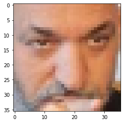
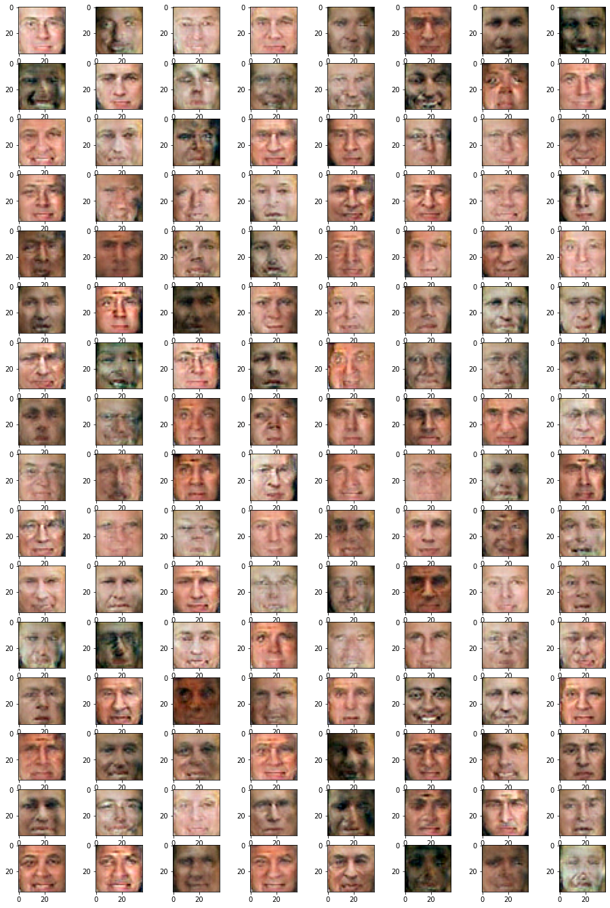

_© research.nvidia.com_

This time we'll train a neural net to generate plausible human faces in all their subtlty: appearance, expression, accessories, etc. 'Cuz when us machines gonna take over Earth, there won't be any more faces left. We want to preserve this data for future iterations. Yikes...

Based on https://github.com/Lasagne/Recipes/pull/94 .


```python
import sys
sys.path.append("..")
import grading
import download_utils
import tqdm_utils
```


```python
import matplotlib.pyplot as plt
%matplotlib inline
import numpy as np
plt.rcParams.update({'axes.titlesize': 'small'})

from sklearn.datasets import load_digits
#The following line fetches you two datasets: images, usable for autoencoder training and attributes.
#Those attributes will be required for the final part of the assignment (applying smiles),
#so please keep them in mind
from lfw_dataset import load_lfw_dataset 
data, attrs = load_lfw_dataset(dimx = 36, dimy = 36)

#preprocess faces
data = np.float32(data) / 255.
IMG_SHAPE = data.shape[1:]
```


      0%|          | 0/13233 [00:00<?, ?it/s]


```python
#print random image
plt.imshow(data[np.random.randint(data.shape[0])], cmap = "gray", interpolation = "none")
```


    <matplotlib.image.AxesImage at 0x7fd1f98d7d50>


    

    


# Generative adversarial nets 101


_© torch.github.io_

Deep learning is simple, isn't it? 
* build some network that generates the face (small image)
* make up a __measure__ of __how good that face is__
* optimize with gradient descent :)


The only problem is: how can we engineers tell well-generated faces from bad? And i bet you we won't ask a designer for help. 

__If we can't tell good faces from bad, we delegate it to yet another neural network!__

That makes the two of them:
* __G__enerator - takes random noize for inspiration and tries to generate a face sample. 
  * Let's call him __G__(z), where z is a gaussian noize.
* __D__iscriminator - takes a face sample and tries to tell if it's great or fake. 
  * Predicts the probability of input image being a __real face__
  * Let's call him __D__(x), x being an image.
  * __D(x)__ is a predition for real image and __D(G(z))__ is prediction for the face made by generator.

Before we dive into training them, let's construct the two networks.


```python
import tensorflow as tf
from tensorflow.keras.models import Sequential
from tensorflow.keras import layers as L
```


```python
CODE_SIZE = 256
generator = Sequential()
generator.add(L.InputLayer([CODE_SIZE], name = 'noise'))
generator.add(L.Dense(10 * 8 * 8, activation = 'elu'))
generator.add(L.Reshape((8, 8, 10)))
generator.add(L.Conv2DTranspose(64, kernel_size = (5, 5), activation = 'elu'))
generator.add(L.Conv2DTranspose(64, kernel_size = (5, 5), activation = 'elu'))
generator.add(L.UpSampling2D(size = (2, 2)))
generator.add(L.Conv2DTranspose(32, kernel_size = 3, activation = 'elu'))
generator.add(L.Conv2DTranspose(32, kernel_size = 3, activation = 'elu'))
generator.add(L.Conv2DTranspose(32, kernel_size = 3, activation = 'elu'))
generator.add(L.Conv2D(3, kernel_size = 3, activation = None))
```


```python
assert generator.output_shape[1:] == IMG_SHAPE, \
    "generator must output an image of shape %s, but instead it produces %s" % (IMG_SHAPE, generator.output_shape[1:])
```

### Discriminator
* Discriminator is your usual convolutional network with interlooping convolution and pooling layers
* The network does not include dropout/batchnorm to avoid learning complications.
* We also regularize the pre-output layer to prevent discriminator from being too certain.


```python
discriminator = Sequential()
discriminator.add(L.InputLayer(IMG_SHAPE))
discriminator.add(L.Conv2D(filters = 32, kernel_size = (3, 3), padding = 'same', activation = 'elu'))
discriminator.add(L.MaxPooling2D(pool_size = (2, 2)))
discriminator.add(L.Conv2D(filters = 64, kernel_size = (3, 3), padding = 'same', activation = 'elu'))
discriminator.add(L.MaxPooling2D(pool_size = (2, 2)))
discriminator.add(L.Conv2D(filters = 128, kernel_size = (3, 3), padding = 'same', activation = 'elu'))
discriminator.add(L.MaxPooling2D(pool_size = (2, 2)))
discriminator.add(L.Conv2D(filters = 256, kernel_size = (3, 3), padding = 'same', activation = 'elu'))
discriminator.add(L.MaxPooling2D(pool_size = (2, 2)))
discriminator.add(L.Flatten())
discriminator.add(L.Dense(256, activation = 'tanh'))
discriminator.add(L.Dense(2, activation = tf.nn.log_softmax))
```

# Training

We train the two networks concurrently:
* Train __discriminator__ to better distinguish real data from __current__ generator
* Train __generator__ to make discriminator think generator is real
* Since discriminator is a differentiable neural network, we train both with gradient descent.


_© deeplearning4j.org_

Training is done iteratively until discriminator is no longer able to find the difference (or until you run out of patience).


### Tricks:
* Regularize discriminator output weights to prevent explosion
* Train generator with __adam__ to speed up training. Discriminator trains with SGD to avoid problems with momentum.
* More: https://github.com/soumith/ganhacks


```python
def discriminator_training(real_data, noise):
    disc_optimizer.minimize \
            (loss = lambda: d_loss(real_data, noise), var_list = discriminator.trainable_weights)

def d_loss(real_data, noise):
    logp_real = discriminator(real_data)
    logp_gen = discriminator(generator(noise))
    loss = -tf.reduce_mean(logp_real[:, 1] + logp_gen[:, 0])
    loss += tf.reduce_mean(discriminator.layers[-1].kernel ** 2) # regularize
    return loss

disc_optimizer = tf.keras.optimizers.SGD(learning_rate = 1e-3)
```


```python
def generator_training(noise):
    gen_optimizer.minimize(loss = lambda: g_loss(noise), var_list = generator.trainable_weights)

def g_loss(noise):
    logp_gen = discriminator(generator(noise))
    return -tf.reduce_mean(logp_gen[:, 1])

gen_optimizer = tf.keras.optimizers.Adam(learning_rate = 1e-4)
```

### Auxiliary functions
Here we define a few helper functions that draw current data distributions and sample training batches.


```python
def sample_noise_batch(bsize):
    return np.random.normal(size = (bsize, CODE_SIZE)).astype('float32')

def sample_data_batch(bsize):
    idxs = np.random.choice(np.arange(data.shape[0]), size = bsize)
    return data[idxs]

def sample_images(nrow,ncol, sharp = False):
    images = generator.predict(sample_noise_batch(bsize = nrow * ncol))
    if np.var(images) != 0:
        images = images.clip(np.min(data), np.max(data))
    for i in range(nrow * ncol):
        plt.subplot(nrow, ncol, i + 1)
        if sharp:
            plt.imshow(images[i].reshape(IMG_SHAPE), cmap = "gray", interpolation = "none")
        else:
            plt.imshow(images[i].reshape(IMG_SHAPE), cmap = "gray")
    plt.show()

def sample_probas(bsize):
    plt.title('Generated vs real data')
    plt.hist (
        np.exp(discriminator.predict(sample_data_batch(bsize)))[:, 1],
        label = 'D(x)', alpha = 0.5,range = [0, 1]
    )
    plt.hist (
        np.exp(discriminator.predict(generator.predict(sample_noise_batch(bsize))))[:, 1],
        label = 'D(G(z))', alpha = 0.5, range = [0, 1]
    )
    plt.legend(loc = 'best')
    plt.show()
```

### Training
Main loop.
We just train generator and discriminator in a loop and plot results once every N iterations.


```python
from IPython import display

num_epochs = 10000
num_batch = 100

for epoch in tqdm_utils.tqdm_notebook_failsafe(range(num_epochs)):
    real_data = sample_data_batch(num_batch)
    noise = sample_noise_batch(num_batch)
    print("Epoch {:05d}".format(epoch))

    for i in range(5):
        discriminator_training(real_data, noise)

    generator_training(noise)

    if epoch % 100 == 0:
        display.clear_output(wait = True)
        sample_images(2, 3, True)
        sample_probas(1000)
```


    

    


    

    


```python
#The network was trained for about 15k iterations. 
#Training for longer yields MUCH better results
plt.figure(figsize = [16, 24])
sample_images(16, 8)
```


    

    

